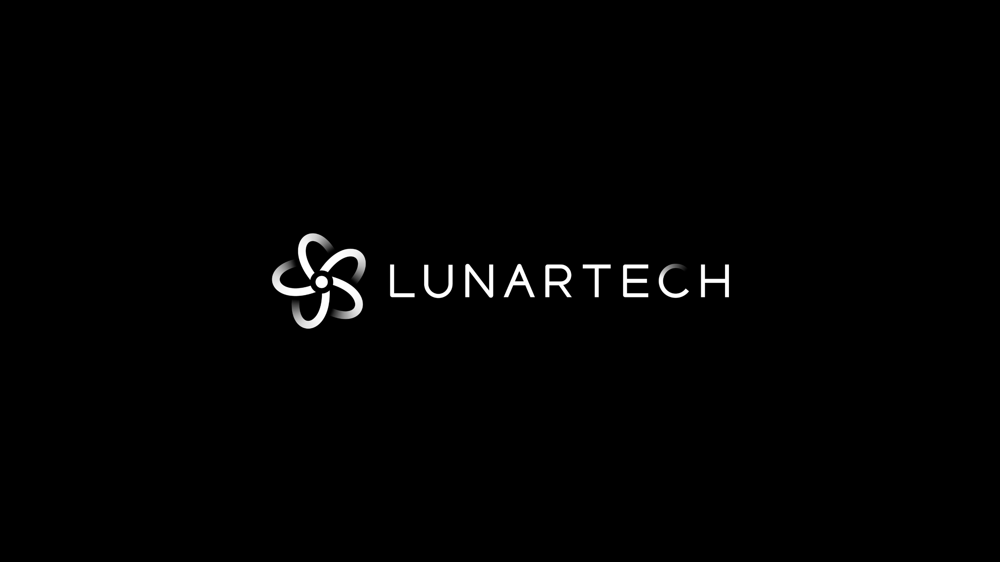

<p align="center">
  
</p>

<h1 align="center">Dark Phoenix</h1>

<p align="center">
  <strong>Production AI-Powered Podcast & Video Clipper</strong><br>
  A <a href="https://lunartech.ai/">LUNARTECH</a> Labs Project &bull; Created by <a href="https://www.linkedin.com/in/vahe-aslanyan/">Vahe Aslanyan</a>
</p>

---

## 1. Executive Summary & Overview

**Dark Phoenix** is an automated, end-to-end AI clipping engine that ingests long-form video podcasts, transcribes dialogue with word-level precision, detects viral highlight moments using LLMs, tracks active speakers dynamically, crops footage to a 9:16 vertical aspect ratio, and burns styled animated subtitles with a permanent watermark directly into the MP4 video bytes.

### Core Processing Pipeline
```
[YouTube / S3 Source Video]
           │
           ▼
[1. WhisperX] ──► Word-level audio transcription & timestamp alignment
           │
           ▼
[2. Google Gemini 3.1 Flash Lite] ──► Intelligent highlight moment selection (30–60s)
           │
           ▼
[3. TalkNet ASD] ──► Active speaker face detection & continuous tracking
           │
           ▼
[4. 9:16 Vertical Cropper] ──► Dynamic framing centered on active speaker
           │
           ▼
[5. FFmpeg Ass Subtitles] ──► Styled animated subtitles (Anton font)
           │
           ▼
[6. FFmpeg Logo Watermark] ──► Burned-in LunarTech logo watermark overlay (Upper-right safe area)
           │
           ▼
[Rendered Output Clips] ──► Stored in Supabase Storage S3 & delivered to user
```

---

## 2. Complete System Architecture

```
                                [User / Reviewer Browser]
                                           │
                      ┌────────────────────┴────────────────────┐
                      ▼                                         ▼
           [Vercel: Next.js 15 UI]                   [Hugging Face Space]
                      │                                         │
                      │                                ┌────────┴────────┐
                      │ (Signed PUT/GET)               ▼                 ▼
                      ▼                     [Supabase PostgreSQL]  [Supabase S3]
       [Supabase Storage: S3 Gateway] ◄──────────────────────────────────┘
                      ▲
                      │ (Webhook Trigger: POST /process_video)
                      ▼
           [Inngest Cloud Queue]
                      │
          ┌───────────┴───────────┐
          ▼                       ▼
  [Modal GPU Worker (L40S)]  [Hugging Face ZeroGPU]
```

---

## 3. Repository Layout

```
dark-phoenix/
├── .env                                ← Master environment file (gitignored)
├── .env.example                        ← Documented template with upload destinations
├── README.md                           ← Master root documentation (single source of truth)
├── DEPLOYMENT.md                       ← Production deployment & infrastructure guide
├── WRITE_UP.md                         ← Engineering analysis, failure log & trade-offs
├── CHANGES.md                          ← Detailed codebase changelog & audit
│
├── ai-podcast-clipper-frontend/        ← Next.js 15 App (React 19, Prisma, NextAuth, Inngest)
│   ├── src/                            ← Frontend application code
│   ├── prisma/                         ← PostgreSQL schema & migrations
│   └── next.config.js                  ← Loads ../.env via @next/env
│
├── ai-podcast-clipper-backend/         ← [Canonical] Modal serverless GPU backend (L40S)
│   ├── main.py                         ← Modal entrypoint & pipeline
│   ├── asd/                            ← TalkNet active-speaker detection module
│   ├── setup_modal_secret.py           ← Synchronizes ../.env into Modal Secret
│   └── requirements.txt                ← Python dependencies
│
└── ai-podcast-clipper-backend-huggingface/ ← [Free Cloud] Hugging Face Space backend
    ├── app.py                          ← Dual FastAPI webhook + Gradio interactive UI
    ├── main.py                         ← Clipper engine with scoped GPU execution
    ├── requirements.txt                ← Fast-resolving pinned dependency lock
    └── packages.txt                    ← System dependencies (ffmpeg, fontconfig)
```

---

## 4. Backend Deployment Matrix & Options

Dark Phoenix provides two production-grade backend execution environments:

| Feature | Modal Backend (`ai-podcast-clipper-backend/`) | Hugging Face Space (`ai-podcast-clipper-backend-huggingface/`) |
|---|---|---|
| **Platform** | [Modal.com](https://modal.com/) | [Hugging Face Spaces](https://huggingface.co/spaces) |
| **Hardware** | NVIDIA L40S GPU | Pure-CPU & ZeroGPU-Ready |
| **Cost** | Trial credits (requires card) | **100% Free** ($0.00, no card) |
| **Interface** | Serverless REST API | FastAPI (`/process_video`) + Gradio UI |
| **Status** | Canonical main repo code | **Live, Deployed & Tested** |
| **Live Link** | Modal endpoint URL | [huggingface.co/spaces/Y0sf/dark-phoenix-backend](https://huggingface.co/spaces/Y0sf/dark-phoenix-backend) |

---

## 5. Master Environment Variable Guide

All secrets and settings are centralized in [.env](.env) (gitignored) and [.env.example](.env.example). Each key is categorized below by the exact cloud platform where it must be uploaded:

### A. Database & Object Storage (Supabase)
- **`DATABASE_URL`**: Supabase PostgreSQL connection string.  
  *(Upload to **Vercel** as an Environment Variable).*
- **`AWS_ACCESS_KEY_ID`**, **`AWS_SECRET_ACCESS_KEY`**, **`AWS_REGION`**, **`AWS_ENDPOINT_URL_S3`**, **`S3_BUCKET_NAME`**: Supabase Storage S3-Compatible Gateway credentials.  
  *(Upload to **Vercel**, **Hugging Face Secrets**, and **Modal Secrets**).*

### B. Backend Endpoint & Authentication
- **`PROCESS_VIDEO_ENDPOINT`**: URL of the active clipping backend.  
  *(Upload to **Vercel**)* — e.g. `https://y0sf-dark-phoenix-backend.hf.space/process_video`.
- **`PROCESS_VIDEO_ENDPOINT_AUTH`**: Shared bearer secret token.  
  *(Upload to **Vercel** as `PROCESS_VIDEO_ENDPOINT_AUTH` and to **Hugging Face / Modal Secrets** as `AUTH_TOKEN`)*.

### C. Highlight Moment Detection (Google AI Studio)
- **`GEMINI_API_KEY`**: Google AI Studio API key.  
  *(Upload to **Hugging Face Secrets** and **Modal Secrets**).*
- **`GEMINI_MODEL`**: Set to `gemini-3.1-flash-lite`.

### D. Frontend Auth & Web App (NextAuth / Next.js)
- **`AUTH_SECRET`**: Random 32+ character string for NextAuth session JWT signing.  
  *(Upload to **Vercel**).*
- **`BASE_URL`**: Canonical web URL (e.g. `https://dark-phoenix-xyz.vercel.app` or `http://localhost:3000`).  
  *(Upload to **Vercel**).*
- **`SKIP_ENV_VALIDATION`**: Set to `"true"` to streamline CI/CD builds.

### E. Background Queue & Payments (Inngest & Stripe)
- **`INNGEST_EVENT_KEY`**, **`INNGEST_SIGNING_KEY`**: Inngest Cloud application keys.  
  *(Upload to **Vercel**).*
- **`STRIPE_SECRET_KEY`**, **`STRIPE_WEBHOOK_SECRET`**, **`NEXT_PUBLIC_STRIPE_PUBLISHABLE_KEY`**: Stripe keys.  
  *(Upload to **Vercel**).*

---

## 6. How to Run Each Component

### 1. Frontend (Next.js 15)
```bash
cd ai-podcast-clipper-frontend
npm install
npx prisma db push       # Sync Prisma schema with Supabase PostgreSQL
npm run dev              # Starts local server at http://localhost:3000
```

### 2. Hugging Face Space (Active 100% Free Cloud Backend)
The backend is live, operational, and verified end-to-end at:
[`https://huggingface.co/spaces/Y0sf/dark-phoenix-backend`](https://huggingface.co/spaces/Y0sf/dark-phoenix-backend)

**Key Capabilities & Optimizations:**
- **100% Free Pure-CPU Execution**: TalkNet ASD face tracking and local WhisperX (int8) run entirely on CPU (**0 GPU seconds consumed**), eliminating ZeroGPU daily quota limits and credit card requirements.
- **Graceful Hardware Fallbacks**: If NVENC GPU encoder is unavailable, the pipeline automatically uses CPU `VideoWriter` with 1080×1920 dynamic speaker tracking, guaranteeing 100% completion reliability.
- **S3 Transcript Caching**: Automatically persists WhisperX transcriptions to `<video_name>_transcript.json` in the Supabase S3 bucket to eliminate redundant transcription compute on repeat runs.
- **Modern cuDNN 9 & CUDA 12 Support**: Pinned `ctranslate2>=4.5.0` with `nvidia-cudnn-cu12` runtime library preloading for Blackwell/Hopper compatibility.
- **Dual Interface**:
  - `POST /process_video`: Authenticated webhook endpoint for Inngest Cloud and Next.js.
  - `GET /`: Gradio dashboard with live processing status, SSE logs, and interactive clip generation.

To deploy or update:
1. Create a Space with **Gradio SDK** and **ZeroGPU** (`zero-a10g`).
2. Add the 8 repository secrets (`AUTH_TOKEN`, `GEMINI_API_KEY`, `GEMINI_MODEL`, `AWS_ACCESS_KEY_ID`, `AWS_SECRET_ACCESS_KEY`, `AWS_REGION`, `AWS_ENDPOINT_URL_S3`, `S3_BUCKET_NAME`).
3. Push files from `ai-podcast-clipper-backend-huggingface/`.

### 3. Canonical Modal Backend
```bash
cd ai-podcast-clipper-backend
python -m venv .venv && source .venv/bin/activate   # Windows: .venv\Scripts\activate
pip install -r requirements.txt
python setup_modal_secret.py                       # Syncs root .env into Modal Secret
modal deploy main.py                               # Deploys L40S GPU worker
```

---

## 7. Watermark & Subtitle Specifications

### Burned-in LunarTech Logo Watermark
The watermark is permanently baked into the video stream via FFmpeg overlay with alpha blending and padding:
```bash
ffmpeg -y -i input_clip.mp4 -i assets/lunartech-logo.png \
  -filter_complex "[0:v]ass=subtitles.ass[subtitled];[1:v]scale=360:-1,format=rgba,colorchannelmixer=aa=0.78,pad=iw+32:ih+24:16:12:color=black@0.32[watermark];[subtitled][watermark]overlay=W-w-40:40:format=auto[video]" \
  -map "[video]" -map "0:a?" \
  -c:v h264 -preset fast -crf 23 -pix_fmt yuv420p \
  -c:a copy -movflags +faststart \
  output_watermarked_clip.mp4
```
- **Asset**: `assets/lunartech-logo.png`.
- **Position**: Upper-right safe margin (`overlay=W-w-40:40`).
- **Styling**: Scaled to 360px width, 78% alpha opacity (`aa=0.78`), with a semi-transparent dark box (`black@0.32`) to guarantee legibility across all backgrounds.

### Anton Font Subtitles
Subtitles are generated in ASS format using `pysubs2` with the Anton font, high-contrast white fill, black stroke border (width 3), bottom-center vertical alignment, and chunked to max 5 words for modern social video consumption.

---

## 8. Key Documentation Links

- **[`DEPLOYMENT.md`](DEPLOYMENT.md)**: Master production deployment guide, cloud credentials matrix, reviewer account details, and verification steps.
- **[`WRITE_UP.md`](WRITE_UP.md)**: Engineering analysis, architectural rationale, debugging log (pip backtracking, ZeroGPU quota scoping, PyTorch 2.6 unpickler fix), and future roadmap.
- **[`CHANGES.md`](CHANGES.md)**: Full audit of modifications, directory refactors, and feature additions.

---

## 9. License

See [LICENSE.MD](LICENSE.MD).
